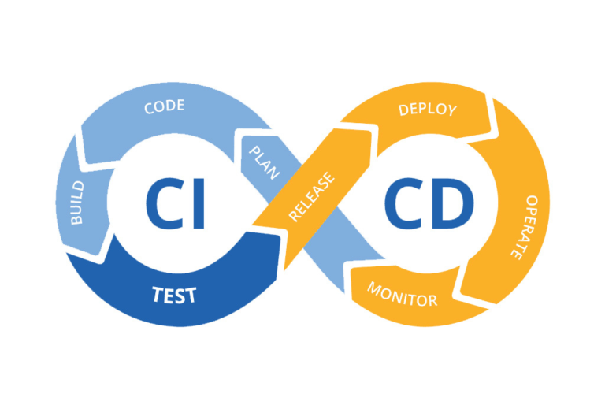
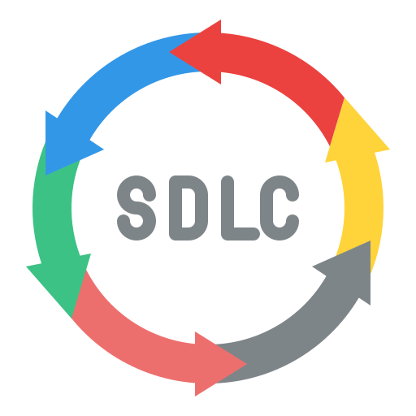

<h1 align="center">
  
</h1>

<h5 align="center">
  <code><a href="https://www.linkedin.com/in/alina-halushkina/" title="LinkedIn Profile"> LinkedIn</a></code>
</h5>
 

  Hi, I'm Alina Halushkina, Automation QA engineer from Warsaw
   
   
  🔎 I am looking for my first internship or junior automation QA position
   
  🎓 I graduated from Moscow State University of Economics, Statistics and Informatics (Bachelor degree)
   
  💻 I have experience with TS, Git, Playwright, Cypress, WDIO, Selenium, CI/CD and Allure
   
  📚 I have a great desire to learn
   
  💬 I speak Russian, English, Polish and Belarussian
   
  📫 You can contact me: <a href="https://www.linkedin.com/in/alina-halushkina-696373104/">LinkedIn</a>

<h2 align="center">🔥 Languages & Frameworks & Tools & Abilities 🔥</h2>
 

    <code></code>
    <code></code>
    <code></code>
    <code></code>
    <code></code>
    <code></code>
    <code></code>
    <code></code>
    <code></code>
    <code></code>
    <code></code>
    <code></code>
    <code></code>
    <code></code>
    <code></code>
    <code></code>
    <code></code>
    <code></code>

<h2 align="center">👨‍💻 Repositories 👨‍💻</h2>

<h4 align="center">
  <a href="https://github.com/Alina-Halushkina?tab=repositories" title="Show Repositories">🔎 Show More 🔍</a>
</h4>
